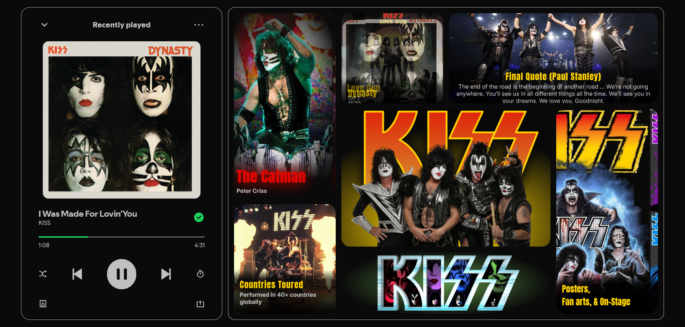

# 🤘 KISS — Bento Grid Music Interface

A **rock concert brought to the browser** — this project is a **bento-style music interface** inspired by the legendary rock band **KISS**.
Featuring their iconic members, albums, and tour legacy, this layout blends **dark theme**, **glassmorphism**, and **CSS animations** to deliver a dynamic and immersive fan-style experience.

---

## ✨ Features

- 🧊 **Bento grid layout** designed like a concert stage
- 🌙 **Dark neon theme** inspired by KISS live shows
- 🪟 **Glassmorphism panels** for a frosted, layered effect
- 🧑‍🎤 **Band Members Section** — animated showcase of the original lineup
- 💿 **Album Highlights** with rotating cover display
- 🏆 **Achievements** & **Tour Stats** panel
- 🖼️ **Fan Art Carousel** bringing the fandom to life
- 🎞️ Pure **CSS animations** (slide, fade, glow, reveal)
- 🪄 **Interactive hover** and **reveal transitions**

---

## 🌐 Live Demo / Review

You can view and interact with the project here:  
👉 [KISS — Bento Grid Music Interface Live Demo](https://harsh-codes-hub.github.io/Bento-Grid-TASK7/)

Step into the rock arena — scroll, hover, and experience the KISS vibe on every block. 🎸✨

---

## 🗂️ File Structure
```
Bento-Grid-TASK7/
│
├── index.html # Main HTML structure for bento grid layout
├── style.css # CSS styling with glass effect, grid, and animations
│
├── /images/ # Images used in layout
│ ├── album-cover.jpg
│ └── ... (other visuals)
│
├── /favicon/ # Icons and web manifest
│ ├── favicon-16x16.png
│ ├── favicon-32x32.png
│ ├── apple-touch-icon.png
│ └── site.webmanifest
│
├── preview.png # Preview image of the page
└── README.md # Project documentation
```

---

## 💻 Usage

1. **Clone the repository:**
   ```bash
   git clone https://github.com/harsh-codes-hub/Bento-grid-layout-TASK7.git
   ```
2. **Navigate to the project directory:**
   ```bash
   cd Bento-grid-layout-TASK7
   ``` 
3. *Open the project in your browser*
   ```
   open index.html
   ```
   or simply double-click on **index.html**

---

## 🧠 Learning Highlights

- 🧱 Practiced **bento-style grid layout** using `grid-template` to structure a concert-stage-inspired interface
- 🪟 Implemented **glassmorphism effects** with `backdrop-filter` to create frosted, layered panels that match KISS’s bold stage lighting
- 🎞️ Used pure **CSS animations** (slide, reveal, fade, glow) to bring band members, albums, and stats to life — no JavaScript required
- 🧭 Explored **z-index layering** and **card positioning** to build depth and spotlight key sections like a live show
- 📱 Designed a **responsive layout** that scales smoothly from big-screen “stadiums” to small mobile “crowds”
- 🤘 Learned how to combine design **aesthetics** with **thematic storytelling** through layout and motion

---

## 🧠 What Makes This Project Special

- 🧱 **Bento grid layout** tailored for music & band branding
- 🪩 Designed around **KISS’s signature stage look** — black background, glowing red & white tones, bold fonts
- 🤘 Unique **band member showcase** with auto slide animations
- 💿 **Albums** and **fan art** fade and slide in just like spotlight moments in a show
- 🪟 Clean **glass panels** that give a frosted arena-light vibe

---

## 📸 Preview

KISS-themed Bento Grid UI featuring the band lineup, albums, fan zone, and glowing neon layout.



---

## 🛠️ Built With

- 🧾 **HTML5**
- 🎨 **CSS3**
- 🧩 **CSS Grid & Flexbox**
- 🪟 **Glassmorphism**
- ✨ **Pure CSS Animations**
- 🤘 **KISS Theme** — rock, glow, and stage-style design

---

## 👨‍💻 Author

**Cohort 2.0 – Batch Task 7 Submission**  
Created by **Harsh Gajrani** _(Harsh Codes Hub)_  
Part of the **Cohort 2.0 batch at Sheryians Coding School**

---

*⭐ If you love KISS or clean music UI design, give this project a star and keep the rock alive!*

---